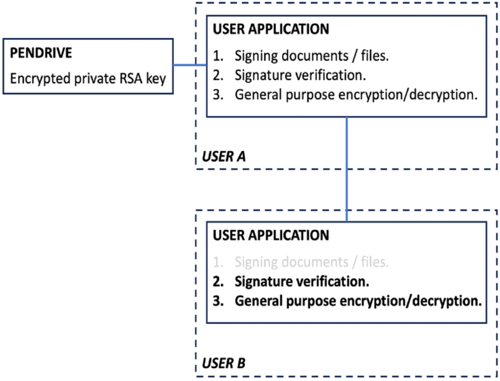

# Computer Systems Security

## [Report in Polish](Bezpieczenstwo_Systemow_Komputerowych.pdf)

## Description

The aim of the project is to develop an application for signing any files using the XAdES standard with a qualified
signature and encrypting them.

The application was written in Java using the default Swing and Crypto graphics library.
User **A** is able to generate a pair of **4096** bit RSA keys (private.key and public.key).
He chooses a location to store them, e.g., a flash drive.
The private key (private.key) is additionally encrypted using the **AES** algorithm.
Then using this key pair he is able to sign, and encrypt the selected file with the **RSA** algorithm.

User **B** can, using the public key he received from user A, decrypt the signed file.
He does not need the public key file to verify the signature, because the public key is included in the signature
structure in the <KeyInfo> tag.

## Application diagram

